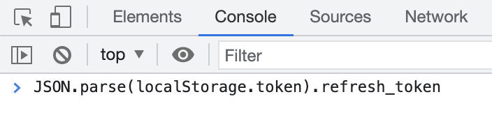

# AliPCS-Py

**2023-02-15 使用临时 API 接口，让下载可用。**

**2023-02-14 阿里网盘 API 下载接口不再提供第三方应用使用。需要申请使用官方 API 接口。目前官方 API 接口在内测中。本项目已提交内测申请，等待回复中。在此期间下载功能不能使用。**

[](https://badge.fury.io/py/alipcs-py)


An AliPCS API and An App

AliPCS-Py 是阿里云盘的非官方 api 和一个命令行运用程序。

---

## 百度云盘 api 和 命令行客户端在 https://github.com/PeterDing/BaiduPCS-Py

---

- [安装](#安装)
- [更新](#更新)
- [API](#API)
- [用法](#用法)
- [命令别名](#命令别名)
- [对多个帐号进行相同操作](#对多个帐号进行相同操作)

#### 用户相关命令

- [添加用户](#添加用户)
- [显示当前用户的信息](#显示当前用户的信息)
- [更新用户信息](#更新用户信息)
- [显示所有用户](#显示所有用户)
- [切换当前用户](#切换当前用户)
- [删除一个用户](#删除一个用户)
- [显示当前工作目录](#显示当前工作目录)
- [切换当前工作目录](#切换当前工作目录)

#### 无感加密解密文件

- [设置文件加密密码](#设置文件加密密码)

#### 文件操作相关命令

- [文件操作](#文件操作)
- [列出网盘路径下的文件](#列出网盘路径下的文件)
- [搜索文件](#搜索文件)
- [显示文件内容](#显示文件内容)
- [创建目录](#创建目录)
- [移动文件](#移动文件)
- [文件重命名](#文件重命名)
- [拷贝文件](#拷贝文件)
- [删除文件](#删除文件)
- [下载文件或目录](#下载文件或目录)
- [播放媒体文件](#播放媒体文件)
- [上传文件](#上传文件)
- [同步本地目录到远端](#同步本地目录到远端)

#### 秒传

- [关于秒传连接](#关于秒传连接)

#### 分享相关命令

- [分享文件](#分享文件)
- [列出分享链接](#列出分享链接)
- [取消分享链接](#取消分享链接)
- [列出其他用户分享链接中的文件](#列出其他用户分享链接中的文件)
- [下载他人分享的文件](#下载他人分享的文件)
- [播放他人分享的文件](#播放他人分享的文件)
- [保存其他用户分享的链接](#保存其他用户分享的链接)

#### 本地保存分享连接

- [保存分享连接至本地](#保存分享连接至本地)
- [显示本地保存的分享连接](#显示本地保存的分享连接)
- [显示本地保存的分享文件](#显示本地保存的分享文件)
- [查找本地保存的分享连接](#查找本地保存的分享连接)
- [查找本地保存的分享文件](#查找本地保存的分享文件)
- [查找本地保存的分享连接和文件](#查找本地保存的分享连接和文件)
- [删除本地保存的分享连接或文件](#删除本地保存的分享连接或文件)
- [清理本地保存的无效分享连接](#清理本地保存的无效分享连接)

#### HTTP 服务

- [开启 HTTP 服务](#开启-HTTP-服务)

## 安装

需要 Python 版本大于或等于 3.7

```
pip3 install Cython
pip3 install AliPCS-Py
```

### Windows 依赖

在 Windows 上，AliPCS-Py 依赖 [Microsoft C++ Build Tools](https://visualstudio.microsoft.com/visual-cpp-build-tools/)。

在安装 AliPCS-Py 前，请先安装 [Microsoft C++ Build Tools](https://visualstudio.microsoft.com/visual-cpp-build-tools/)，再在其中勾选 `C++ 生成工具` 并安装。完成后即可安装 AliPCS-Py。

## 更新

```
pip3 install AliPCS-Py --upgrade
```

## API

AliPCS-Py 的阿里云盘 API 只依赖 requests，方便用户开发自己的运用。

```python
from alipcs_py.alipcs import AliPCSApi

api = AliPCSApi(refresh_token)
```

## 用法

```
AliPCS-Py --help
```

## 命令别名

可以用下面的命令别名代替原来的命令名。

| 别名 | 原名         |
| ---- | ------------ |
| w    | who          |
| uu   | updateuser   |
| su   | su           |
| ul   | userlist     |
| ua   | useradd      |
| ep   | encryptpwd   |
| ud   | userdel      |
| l    | ls           |
| f    | search       |
| md   | mkdir        |
| mv   | move         |
| rn   | rename       |
| cp   | copy         |
| rm   | remove       |
| d    | download     |
| p    | play         |
| u    | upload       |
| sn   | sync         |
| S    | share        |
| sl   | shared       |
| cs   | cancelshared |
| s    | save         |
| sv   | server       |

## 对多个帐号进行相同操作

AliPCS-Py 支持对多个帐号进行相同操作。比如，用相同关键字搜索多个帐号，上传相同的文件/目录到多个帐号，等等。

使用者只需用 `--users` 选项来指定要操作的帐号名即可。

`--users` 接受一个参数，这个参数是用“,”连接的要进行操作帐号名的部分字符。假设我们现在有 3 个帐号，帐号名分别是 `Tom`，`Peter`，`Joy`。
现在我要同时对`Tom`和`Joy`进行关键字搜索。我们可以用下面的命令进行：

```
AliPCS-Py --users 'Tom,Joy' search 'keyword' / -R
```

或者给出帐号名的部分片段：

```
AliPCS-Py --users 'om,oy' search 'keyword' / -R
```

更简单可以用：

```
# Tom, Joy 都包含字符 "o"
AliPCS-Py --users 'o' search 'keyword' / -R
```

如果要对所有帐号进行操作用 `--users ''`。

如果不使用 `--users` 选项，默认只对当前帐号进行操作。

以下命令支持对多个帐号进行操作：

- pwd
- ls
- search
- cat
- mkdir
- move
- rename
- copy
- remove
- download
- play
- upload
- sync
- share
- shared
- cancelshared
- save
- server

**注意**: `--users` 一定要跟在 `AliPCS-Py` 后，命令前。

## 添加用户

**从 2023-02-14 开始，阿里云盘官方限制了 web 端 api 的调用。从 web 端 api 获取到的下载连接是限速的。但如果调用[阿里云盘开放平台](https://survey.alibaba.com/apps/zhiliao/I9Dd1Nl89)的 api 获取到的下载连接是不限速的。**

AliPCS-Py (>= v0.6.0) 支持调用阿里云盘开放平台 api。但是由于一直没有拿到内测，没法提供默认登录操作。需要用户自己找其他应用提供的登录方式登录。

### 使用 web `refresh_token` 和 第三方认证地址 登录

第三方认证地址提供阿里云盘开放平台的认证服务。由于一直没有拿到内存，本项目目前没法提供。需要使用者自行寻找。

交互添加：

```
AliPCS-Py useradd
```

或者直接添加：

```
AliPCS-Py useradd --web-refresh-token "..." --client-server "..."
# 其他选项留空
```

之后用阿里云盘 APP 扫码登录。

### 使用 web `refresh_token` 和 阿里云盘开放平台认证凭证 登录

如果使用者拿到了阿里云盘开放平台认证，会获得 `client-id` 和 `client-secret`。使用这两个值可以直接登录。

交互添加：

```
AliPCS-Py useradd
```

或者直接添加：

```
AliPCS-Py useradd --web-refresh-token "..." --client-id "..." --client-secret "..."
# 其他选项留空
```

之后用阿里云盘 APP 扫码登录。

### 使用 web `refresh_token` 登录

使用者需要在 https://www.aliyundrive.com/drive/ 登录后获取 `refresh_token` 值，并用命令 `useradd` 为 AliPCS-Py 添加一个用户。`useradd` 其他参数留空就好。

使用者可以用下面的方式获取用户的 `refresh_token` 值。

1. 登录 https://www.aliyundrive.com/drive/
2. 打开浏览器的开发者工具(如 Chrome DevTools)。
3. 然后选择开发者工具的 Console 面板。输入 `JSON.parse(localStorage.token).refresh_token`，再回车，获取 `refresh_token`。



现在找到了 `refresh_token` 值，我们可以用下面的命令添加一个用户。

交互添加：

```
AliPCS-Py useradd
```

或者直接添加：

```
AliPCS-Py useradd --web-refresh-token "..."
```

AliPCS-Py 支持多用户，你只需一直用 `useradd` 来添加用户即可。

**注意：如果只用 `--web-refresh-token` 登录，下载文件时，服务器端会限速。**

## 显示当前用户的信息

```
AliPCS-Py who
```

或者：

```
AliPCS-Py who user_id
```

指明显示用户 id 为 `user_id` 的用户信息。

### 选项

| Option                       | Description                |
| ---------------------------- | -------------------------- |
| -K, --show-encrypt-password  | 显示加密密码               |
| --account-name TEXT          | 账号名 [默认为 user id]    |
| --web-refresh-token TEXT     | 用户 web_refresh_token     |
| --openapi-refresh-token TEXT | 用户 openapi_refresh_token |
| --client-id TEXT             | openapi client id          |
| --client-secret TEXT         | openapi client secret      |
| --client-server TEXT         | openapi client server      |

## 更新用户信息

默认更新当前用户信息。

```
AliPCS-Py updateuser
```

也可指定多个 `user_id`

```
AliPCS-Py updateuser user_id
```

## 显示所有用户

```
AliPCS-Py userlist
```

## 切换当前用户

```
AliPCS-Py su
```

或者指定用户列表中用户所在的位置：

```
AliPCS-Py su 2
```

## 删除一个用户

```
AliPCS-Py userdel
```

## 设置文件加密密码

AliPCS-Py 支持“无感的”文件加密。

AliPCS-Py 可以加密上传文件，在下载的时候自动解密，让使用者感觉不到加密解密的过程。

如果使用者需要将保密文件上传至阿里云盘保存，可以使用这个方法。即使帐号被盗，攻击者也无法还原文件内容。

AliPCS-Py 支持以下加密方法：

- **Simple** 一种简单的加密算法。根据密钥生成一个字节对照表来加密解密文件。
  速度快，但**不安全**，不建议加密重要文件。
  因为这种算法加解密不需要知道上下文信息，所以，下载时支持分段下载，如果是媒体文件则支持拖动播放。
  推荐用于加密不重要的媒体文件。
- **ChaCha20** 工业级加密算法，速度快，推荐用于加密重要文件。不支持分段下载。
- **AES256CBC** 工业级加密算法，推荐用于加密重要文件。不支持分段下载。

**注意**：用命令 `encryptpwd` 设置的密码**只是为当前用户**的。

为当前用户设置加密密码:

交互添加：

```
AliPCS-Py encryptpwd
```

或者直接添加：

```
AliPCS-Py encryptpwd --encrypt-password 'my-encrypt-password'
```

上传并加密文件：

上传和同步文件时只需要指定加密算法就可。如果不指定就不加密。

```
# 默认使用上面设置的 `encrypt-password`
AliPCS-Py upload some-file.mp4 some-dir/ /to/here --encrypt-type AES256CBC
```

下载并用上面设置的 `encrypt-password` 自动解密文件：

```
AliPCS-Py download /to/here/some-file.mp4 /to/here/some-dir/
```

也可以使用临时的 `encrypt-password`：

```
AliPCS-Py upload some-file.mp4 some-dir/ /to/here --encrypt-type Simple --encrypt-password 'onlyyou'
```

但在使用临时的 `encrypt-password` 后，`cat`、下载和播放这些文件时需要指定 `encrypt-password`，但不需要指定加密算法，程序会自动检查加密算法：

```
# 下载
AliPCS-Py download /to/here/some-file.mp4 /to/here/some-dir/  --encrypt-password 'onlyyou'

# 开启本地服务并播放
AliPCS-Py play /to/here/some-file.mp4 --encrypt-password 'onlyyou' --use-local-server
```

显示当前用户的密钥：

```
AliPCS-Py who --show-encrypt-password
```

AliPCS-Py 下载时默认会解密文件，如果想要下载但不解密文件，需要加 `--no-decrypt`

```
AliPCS-Py download some-file --no-decrypt
```

## 文件操作

AliPCS-Py 操作网盘中的文件可以使用文件的绝对路径或相对路径（相对与当前目录 pwd）。

每一个用户都有自己的当前工作目录（pwd），默认为 `/` 根目录。

使用者可以用 `cd` 命令来切换当前的工作目录（pwd）。

下面所有涉及网盘路径的命令，其中如果网盘路径用的是相对路径，那么是相对于当前工作目录（pwd）的。
如果是网盘路径用的是绝对路径，那么就是这个绝对路径。

## 显示当前工作目录

```
AliPCS-Py pwd
```

## 切换当前工作目录

切换到绝对路径：

```
AliPCS-Py cd /to/some/path
```

切换到相对路径：

```
# 切换到 (pwd)/../path
AliPCS-Py cd ../path
```

## 列出网盘路径下的文件

使用文件路径：

```
AliPCS-Py ls [OPTIONS] [REMOTEPATHS]...

AliPCS-Py ls /absolute/path

# or
AliPCS-Py ls relative/path
```

使用文件 ID：

```
AliPCS-Py ls -i file_id1 -i file_id2 -i ...
```

### 选项

| Option                     | Description                                           |
| -------------------------- | ----------------------------------------------------- |
| -i, --file-id TEXT         | 文件 ID                                               |
| --share-id, --si TEXT      | 列出这个分享 ID 下的文件                              |
| --share-url, --su TEXT     | 列出这个分享 url 下的文件                             |
| -p, --password TEXT        | 分享链接密码，如果没有不用设置                        |
| -r, --desc                 | 逆序排列文件                                          |
| -n, --name                 | 依名字排序                                            |
| -t, --time                 | 依时间排序                                            |
| -s, --size                 | 依文件大小排序                                        |
| -R, --recursive            | 递归列出文件                                          |
| -I, --include TEXT         | 筛选包含这个字符串的文件                              |
| --include-regex, --IR TEXT | 筛选包含这个正则表达式的文件                          |
| -E, --exclude TEXT         | 筛选 **不** 包含这个字符串的文件                      |
| --exclude-regex, --ER TEXT | 筛选 **不** 包含这个正则表达式的文件                  |
| -f, --is-file              | 筛选 **非** 目录文件                                  |
| -d, --is-dir               | 筛选目录文件                                          |
| --no-highlight, --NH       | 取消匹配高亮                                          |
| -S, --show-size            | 显示文件大小                                          |
| -D, --show-date            | 显示文件创建时间                                      |
| --show-file-id, --ID       | 显示文件 ID                                           |
| -M, --show-hash            | 显示文件 sha1                                         |
| -A, --show-absolute-path   | 显示文件绝对路径                                      |
| --show-dl-link, --DL       | 显示文件下载连接                                      |
| --csv                      | 用 csv 格式显示，单行显示，推荐和 --DL 或 --HL 一起用 |
| --only-dl-link, --ODL      | 只显示文件下载连接                                    |

## 搜索文件

搜索包含 `keyword` 的文件

```
AliPCS-Py search [OPTIONS] KEYWORD [REMOTEDIR]

# 在当前工作目录中搜索
AliPCS-Py search keyword

# or
AliPCS-Py search keyword /absolute/path

# or
AliPCS-Py search keyword relative/path
```

### 选项

| Option                     | Description                          |
| -------------------------- | ------------------------------------ |
| -R, --recursive            | 递归搜索文件                         |
| -I, --include TEXT         | 筛选包含这个字符串的文件             |
| --include-regex, --IR TEXT | 筛选包含这个正则表达式的文件         |
| -E, --exclude TEXT         | 筛选 **不** 包含这个字符串的文件     |
| --exclude-regex, --ER TEXT | 筛选 **不** 包含这个正则表达式的文件 |
| -f, --is-file              | 筛选 **非** 目录文件                 |
| -d, --is-dir               | 筛选目录文件                         |
| --no-highlight, --NH       | 取消匹配高亮                         |
| -S, --show-size            | 显示文件大小                         |
| -D, --show-date            | 显示文件创建时间                     |
| -M, --show-hash            | 显示文件 sha1                        |
| --csv                      | 用 csv 格式显示                      |

## 显示文件内容

```
AliPCS-Py cat [OPTIONS] REMOTEPATH
```

### 选项

| Option                        | Description                  |
| ----------------------------- | ---------------------------- |
| -e, --encoding TEXT           | 文件编码，默认自动解码       |
| --no-decrypt, --ND            | 不解密                       |
| --encrypt-password, --ep TEXT | 加密密码，默认使用用户设置的 |

## 创建目录

```
AliPCS-Py mkdir [OPTIONS] [REMOTEDIRS]...
```

### 选项

| Option     | Description |
| ---------- | ----------- |
| -S, --show | 显示目录    |

## 移动文件

移动一些文件到一个目录中。

```
AliPCS-Py move [OPTIONS] [REMOTEPATHS]... REMOTEDIR
```

### 选项

| Option     | Description |
| ---------- | ----------- |
| -S, --show | 显示结果    |

## 文件重命名

```
AliPCS-Py rename [OPTIONS] REMOTEPATH NEW_NAME
```

e.g.

重命名 `/path/to/far` to `/path/to/foo`

```
AliPCS-Py rename /path/to/far foo
```

### 选项

| Option     | Description |
| ---------- | ----------- |
| -S, --show | 显示结果    |

## 拷贝文件

拷贝一些文件到一个目录中。

```
AliPCS-Py move [OPTIONS] [REMOTEPATHS]... REMOTEDIR
```

### 选项

| Option     | Description |
| ---------- | ----------- |
| -S, --show | 显示结果    |

## 删除文件

```
AliPCS-Py remove [OPTIONS] [REMOTEPATHS]...

# 指定 路径
AliPCS-Py remove /some/path
# 指定 file-id
AliPCS-Py remove --file-id ...
```

### 选项

| Option        | Description  |
| ------------- | ------------ |
| -i, --file-id | TEXT 文件 ID |

## 下载文件或目录

使用文件路径：

```
AliPCS-Py download [OPTIONS] [REMOTEPATHS]...
```

使用文件 ID：

```
AliPCS-Py download -i file_id1 -i file_id2 -i ...
```

### 选项

| Option                                                 | Description                                                                                                                                                                                                                                                                                                                                                                                                                                                    |
| ------------------------------------------------------ | -------------------------------------------------------------------------------------------------------------------------------------------------------------------------------------------------------------------------------------------------------------------------------------------------------------------------------------------------------------------------------------------------------------------------------------------------------------- |
| -i, --file-id TEXT                                     | 文件 ID                                                                                                                                                                                                                                                                                                                                                                                                                                                        |
| --share-id, --si TEXT                                  | 下载这个分享 ID 下的文件                                                                                                                                                                                                                                                                                                                                                                                                                                       |
| --share-url, --su TEXT                                 | 下载这个分享 url 下的文件                                                                                                                                                                                                                                                                                                                                                                                                                                      |
| -p, --password TEXT                                    | 分享链接密码，如果没有不用设置                                                                                                                                                                                                                                                                                                                                                                                                                                 |
| -o, --outdir TEXT                                      | 指定下载本地目录，默认为当前目录                                                                                                                                                                                                                                                                                                                                                                                                                               |
| -R, --recursive                                        | 递归下载                                                                                                                                                                                                                                                                                                                                                                                                                                                       |
| -f, --from-index INTEGER                               | 从所有目录中的第几个文件开始下载，默认为 0（第一个）                                                                                                                                                                                                                                                                                                                                                                                                           |
| -I, --include TEXT                                     | 筛选包含这个字符串的文件                                                                                                                                                                                                                                                                                                                                                                                                                                       |
| --include-regex, --IR TEXT                             | 筛选包含这个正则表达式的文件                                                                                                                                                                                                                                                                                                                                                                                                                                   |
| -E, --exclude TEXT                                     | 筛选 不 包含这个字符串的文件                                                                                                                                                                                                                                                                                                                                                                                                                                   |
| --exclude-regex, --ER TEXT                             | 筛选 不 包含这个正则表达式的文件                                                                                                                                                                                                                                                                                                                                                                                                                               |
| -s, --concurrency INTEGER                              | 下载同步链接数，默认为 5。建议小于 10。                                                                                                                                                                                                                                                                                                                                                                                                                        |
| -k, --chunk-size TEXT                                  | 同步链接分块大小，默认为 50MB                                                                                                                                                                                                                                                                                                                                                                                                                                  |
| -q, --quiet                                            | 取消第三方下载应用输出                                                                                                                                                                                                                                                                                                                                                                                                                                         |
| --out-cmd, --OC                                        | 输出第三方下载应用命令                                                                                                                                                                                                                                                                                                                                                                                                                                         |
| -d, --downloader [ me \| aget_py \| aget_rs \| aria2 ] | 指定下载应用<br> <br> 默认为 me (AliPCS-Py 自己的下载器，支持断续下载)<br> me 使用多文件并发下载。<br> <br> 除 me 外，其他下载器，不使用多文件并发下载，使用一个文件多链接下载。<br> 如果需要下载多个小文件推荐使用 me，如果需要下载少量大文件推荐使用其他下载器。<br> <br> aget_py (https://github.com/PeterDing/aget) 默认安装<br> aget_rs (下载 https://github.com/PeterDing/aget-rs/releases)<br> aria2 (下载 https://github.com/aria2/aria2/releases)<br> |
| --encrypt-password, --ep TEXT                          | 加密密码，默认使用用户设置的                                                                                                                                                                                                                                                                                                                                                                                                                                   |

## 播放媒体文件

使用文件路径：

```
AliPCS-Py play [OPTIONS] [REMOTEPATHS]...
```

使用文件 ID：

**注意：目前，使用 `--share-id` 或 `--file-id` 时，无法使用 `--use-local-server`**

```
AliPCS-Py play -i file_id1 -i file_id2 -i ...
```

`play` 命令默认播放带有媒体后缀的文件，如 `abc.mp4`, `abc.mp3`。如果需要播放的媒体文件没有用常规的媒体文件后缀，则需要加选项 `--ignore-ext`。

### 选项

| Option                        | Description                                          |
| ----------------------------- | ---------------------------------------------------- |
| -i, --file-id TEXT            | 文件 ID                                              |
| --share-id, --si TEXT         | 播放这个分享 ID 下的文件                             |
| --share-url, --su TEXT        | 播放这个分享 url 下的文件                            |
| -p, --password TEXT           | 链接密码，如果没有不用设置                           |
| -R, --recursive               | 递归播放                                             |
| -f, --from-index INTEGER      | 从所有目录中的第几个文件开始播放，默认为 0（第一个） |
| -I, --include TEXT            | 筛选包含这个字符串的文件                             |
| --include-regex, --IR TEXT    | 筛选包含这个正则表达式的文件                         |
| -E, --exclude TEXT            | 筛选 不 包含这个字符串的文件                         |
| --exclude-regex, --ER TEXT    | 筛选 不 包含这个正则表达式的文件                     |
| --player-params, --PP TEXT    | 第三方播放器参数                                     |
| -q, --quiet                   | 取消第三方播放器输出                                 |
| --shuffle, --sf               | 随机播放                                             |
| --ignore-ext, --IE            | 不用文件名后缀名来判断媒体文件                       |
| --out-cmd, --OC               | 输出第三方播放器命令                                 |
| --pl, --player [mpv]          | 指定第三方播放器<br><br>默认为 mpv (https://mpv.io)  |
| -s, --use-local-server        | 使用本地服务器播放。                                 |
| --encrypt-password, --ep TEXT | 加密密码，默认使用用户设置的                         |

## 上传文件

上传一些本地文件或目录到网盘目录。

AliPCS-Py 首先会尝试秒传。如果秒传失败，会使用分片上传上传文件。

上传过程中，按 “p” 可以暂停或继续上传。

```
AliPCS-Py upload [OPTIONS] [LOCALPATHS]... REMOTEDIR
```

指定上传方式：

`--upload-type Many`: 同时上传多个文件。

适合大多数文件长度小于 100M 以下的情况。

```
AliPCS-Py upload --upload-type Many [OPTIONS] [LOCALPATHS]... REMOTEDIR
```

<del>`--upload-type One`: 一次只上传一个文件，但同时上传文件的多个分片。</del>

<del>适合大多数文件长度大于 1G 以上的情况。</del>

**阿里网盘不支持单文件并发上传。`upload --upload-type One` 失效**

```
AliPCS-Py upload --upload-type One [OPTIONS] [LOCALPATHS]... REMOTEDIR
```

指定同时上传连接数量:

`--max-workers` 默认为 CPU 核数。

```
AliPCS-Py upload --max-workers 4 [OPTIONS] [LOCALPATHS]... REMOTEDIR
```

如果上传本地目录 `localdir` 到远端目录 `remotedir`，AliPCS-Py 是将 `localdir` 这个目录上传到远端目录 `remotedir` 下。

比如，`localdir` 下有 2 个文件 `a`，`b` 和一个下级目录 `sub/`，如果运行 `AliPCS-Py upload localdir remotedir`，结果是远端目录 `remotedir` 下增加了 1 个下级目录和它的所有文件 `localdir/a`，`localdir/b` 和一个下级目录 `localdir/sub/`。

如果要将 `localdir` 下的所有文件（包括下级目录）上传到远端目录 `remotedir`，用 `AliPCS-Py upload localdir/* remotedir`

### 选项

| Option                                                     | Description                             |
| ---------------------------------------------------------- | --------------------------------------- |
| -t, --upload-type [One \| Many]                            | 上传方式，Many (默认): 同时上传多个文件 |
| --encrypt-password, --ep TEXT                              | 加密密码，默认使用用户设置的            |
| -e, --encrypt-type [No \| Simple \| ChaCha20 \| AES256CBC] | 文件加密方法，默认为 No 不加密          |
| -w, --max-workers INTEGER                                  | 同时上传文件连接数量，默认为 CPU 核数   |
| --no-ignore-existing, --NI                                 | 上传已经存在的文件                      |
| --no-show-progress, --NP                                   | 不显示上传进度                          |

## 同步本地目录到远端

同步本地目录到远端。

如果本地文件最后修改时间或大小和远端不同则上传文件。对于本地不存在的文件但远端存在则删除远端文件。

```
AliPCS-Py sync [OPTIONS] LOCALDIR REMOTEDIR
```

### 选项

| Option                                                     | Description                    |
| ---------------------------------------------------------- | ------------------------------ |
| --encrypt-password, --ep TEXT                              | 加密密码，默认使用用户设置的   |
| -e, --encrypt-type [No \| Simple \| ChaCha20 \| AES256CBC] | 文件加密方法，默认为 No 不加密 |
| -w, --max-workers INTEGER                                  | 同时上传文件数                 |
| --no-show-progress, --NP                                   | 不显示上传进度                 |

## 关于秒传连接

**阿里云盘已经不能实现用秒传连接上传。**

## 分享文件

```
AliPCS-Py share [OPTIONS] [REMOTEPATHS]...
```

### 选项

| Option                      | Description                      |
| --------------------------- | -------------------------------- |
| -p, --password TEXT         | 设置秘密，4 个字符。默认没有秘密 |
| --period-time, --pt INTEGER | 设置分享有效期，单位为天         |

## 列出分享链接

```
AliPCS-Py shared
```

### 选项

| Option         | Description                                  |
| -------------- | -------------------------------------------- |
| -A, --show-all | 显示所有分享的链接，默认只显示有效的分享链接 |

## 取消分享链接

```
AliPCS-Py cancelshared [OPTIONS] [SHARE_IDS]...
```

## 列出其他用户分享链接中的文件

给 `ls` 命令加参数，我们可以列出其他用户分享链接中的文件。

**注意: 这里 `remotepaths` 只能是绝对路径。**

如果有分享密码，加上 `--password PASSWORD`。

- 使用分享连接

  ```
  AliPCS-Py ls --share-url SHARE_URL

  # e.g.

  # 列出这个分享url的根目录
  AliPCS-Py ls --share-url https://www.aliyundrive.com/s/DaNNsdvi9bi

  # 递归列出这个分享url的文件
  AliPCS-Py ls --share-url https://www.aliyundrive.com/s/DaNNsdvi9bi -R

  # 列出这个分享url的指定目录
  AliPCS-Py ls --share-url https://www.aliyundrive.com/s/DaNNsdvi9bi/folder/613397974b634251e0554d7cb56df3e46d473239
  ```

- 使用分享 ID

  分享 ID 是 https://www.aliyundrive.com/s/DaNNsdvi9bi 中的 `DaNNsdvi9bi`

  ```
  AliPCS-Py ls /path --share-id SHARE_ID

  # e.g.

  # 列出这个分享ID的根目录
  AliPCS-Py ls / --share-id DaNNsdvi9bi

  # 列出这个分享ID下，文件名为 "613397974b634251e0554d7cb56df3e46d473239" 的文件
  AliPCS-Py ls --file-id 613397974b634251e0554d7cb56df3e46d473239 --share-id DaNNsdvi9bi
  ```

### 选项

见 `ls` 命令。

## 下载他人分享的文件

使用 `--share-id` 或 `--share-url` 选项，`download` 命令可以直接下载他人分享的文件。

**注意: 这里必须指定下载绝对路径或 file id**

```
AliPCS-Py download /path --share-url SHARED_URL

# or

AliPCS-Py download /path --share-id SHARED_URL

# or

AliPCS-Py download --file-id FILE_ID --share-id SHARED_URL
```

- 使用分享连接

  ```
  # 下载这个分享url下的根目录中的文件
  AliPCS-Py download / --share-url https://www.aliyundrive.com/s/DaNNsdvi9bi

  # 递归下载这个分享url下的所有的文件
  AliPCS-Py download / --share-url https://www.aliyundrive.com/s/DaNNsdvi9bi -R

  # 下载这个分享url的指定目录
  AliPCS-Py download --share-url https://www.aliyundrive.com/s/DaNNsdvi9bi/folder/613397974b634251e0554d7cb56df3e46d473239
  ```

- 使用分享 ID

  ```
  # 下载这个分享url下的根目录中的文件
  AliPCS-Py download / --share-id DaNNsdvi9bi

  # 递归下载这个分享url下的所有的文件
  AliPCS-Py download / --share-id DaNNsdvi9bi -R

  # 下载这个分享ID下，文件名为 "613397974b634251e0554d7cb56df3e46d473239" 的文件
  AliPCS-Py download --file-id 613397974b634251e0554d7cb56df3e46d473239 --share-id DaNNsdvi9bi
  ```

### 选项

见 `download` 命令。

## 播放他人分享的文件

使用 `--share-id` 或 `--share-url` 选项，`play` 命令可以直接播放他人分享的媒体文件。

**注意: 这里必须指定下载绝对路径或 file id**

```
AliPCS-Py play /path --share-url SHARED_URL

# or

AliPCS-Py play /path --share-id SHARED_URL

# or

AliPCS-Py play --file-id FILE_ID --share-id SHARED_URL
```

- 使用分享连接

  ```
  # 播放这个分享url下的根目录中的文件
  AliPCS-Py play / --share-url https://www.aliyundrive.com/s/DaNNsdvi9bi

  # 递归播放这个分享url下的所有的文件
  AliPCS-Py play / --share-url https://www.aliyundrive.com/s/DaNNsdvi9bi -R

  # 播放这个分享url的指定目录
  AliPCS-Py play --share-url https://www.aliyundrive.com/s/DaNNsdvi9bi/folder/613397974b634251e0554d7cb56df3e46d473239
  ```

- 使用分享 ID

  ```
  # 播放这个分享url下的根目录中的文件
  AliPCS-Py play --share-id DaNNsdvi9bi

  # 递归播放这个分享url下的所有的文件
  AliPCS-Py play --share-id DaNNsdvi9bi -R

  # 播放这个分享ID下，文件名为 "613397974b634251e0554d7cb56df3e46d473239" 的文件
  AliPCS-Py play --file-id 613397974b634251e0554d7cb56df3e46d473239 --share-id DaNNsdvi9bi
  ```

### 选项

见 `play` 命令。

## 保存其他用户分享的链接

保存其他用户分享的链接到远端目录。

```
AliPCS-Py save [OPTIONS] SHARE_URL_OR_ID REMOTEDIR
```

指定 `--file-id` 可以保存指定的文件。

### 选项

| Option              | Description                    |
| ------------------- | ------------------------------ |
| -i, --file-id TEXT  | 文件 ID                        |
| -p, --password TEXT | 分享链接密码，如果没有不用设置 |

## 本地保存分享连接

可以将他人分享了连接保存至本地，而不需要保存在网盘。这只作为一个记录。在需要是提供查看搜索功能。

使用这个功能，需要使用者在本地配置文件(`~/.alipcs-py/config.toml`)中配置:

```toml
[share]
store = true
```

这个功能开启后，所有与他人分享连接的操作，都会将连接和其中访问过的文件信息保存在本地文件 `~/.alipcs-py/shared-store.sqlite3` 中。

使用者可以用下面的命令来查看或搜索保存的分享连接。

## 保存分享连接至本地

```
AliPCS-Py storesharedlinks [OPTIONS] [SHARE_URLS_OR_IDS]...
```

**注意**: 使用这个命令必须将配置文件 ~/.alipcs-py/config.toml 中的 [share] store 设为 true

| Option              | Description                    |
| ------------------- | ------------------------------ |
| -p, --password TEXT | 分享链接密码，如果没有不用设置 |

## 显示本地保存的分享连接

```
AliPCS-Py listsharedlinks
```

**注意**: 使用这个命令必须将配置文件 ~/.alipcs-py/config.toml 中的 [share] store 设为 true

## 显示本地保存的分享文件

```
AliPCS-Py listsharedfiles [OPTIONS]
```

**注意**: 使用这个命令必须将配置文件 ~/.alipcs-py/config.toml 中的 [share] store 设为 true

| Option                | Description                |
| --------------------- | -------------------------- |
| --share-id, --si TEXT | 指定显示 share id 下的文件 |

## 查找本地保存的分享连接

```
AliPCS-Py findsharedlinks [KEYWORDS]...
```

**注意**: 使用这个命令必须将配置文件 ~/.alipcs-py/config.toml 中的 [share] store 设为 true

## 查找本地保存的分享文件

```
AliPCS-Py findsharedfiles [KEYWORDS]...
```

**注意**: 使用这个命令必须将配置文件 ~/.alipcs-py/config.toml 中的 [share] store 设为 true

| Option                | Description       |
| --------------------- | ----------------- |
| --share-id, --si TEXT | 要搜索的 share id |
| -v, --verbose         | 显示细节          |

## 查找本地保存的分享连接和文件

```
AliPCS-Py findshared [OPTIONS] [KEYWORDS]...
```

**注意**: 使用这个命令必须将配置文件 ~/.alipcs-py/config.toml 中的 [share] store 设为 true

| Option        | Description |
| ------------- | ----------- |
| -v, --verbose | 显示细节    |

## 删除本地保存的分享连接或文件

```
AliPCS-Py deletestoredshared [OPTIONS] [SHARE_IDS]...
```

**注意**: 使用这个命令必须将配置文件 ~/.alipcs-py/config.toml 中的 [share] store 设为 true

| Option             | Description                                                |
| ------------------ | ---------------------------------------------------------- |
| -k, --keyword TEXT | 要删除文件名的关键字，如果为空则删除 share_id 下的所有文件 |

## 清理本地保存的无效分享连接

```
AliPCS-Py cleanstore
```

**注意**: 使用这个命令必须将配置文件 ~/.alipcs-py/config.toml 中的 [share] store 设为 true

## 开启 HTTP 服务

在远端 `ROOT_DIR` 目录下开启 HTTP 服务。

`ROOT_DIR` 默认为 `/`

```
AliPCS-Py AliPCS-Py server [OPTIONS] [ROOT_DIR]
```

如果需要设置认证，使用下面的选项设置用户名和密钥：

```
AliPCS-Py AliPCS-Py server [ROOT_DIR] --username 'foo' --password 'bar'
```

也可以指定服务路径：

```
AliPCS-Py AliPCS-Py server [ROOT_DIR] --path '/my/pan'

# 访问 http://localhost:8000/my/pan/
```

### 选项

| Option                        | Description                  |
| ----------------------------- | ---------------------------- |
| --path TEXT                   | 服务路径，默认为 “/”         |
| -h, --host TEXT               | 监听 host                    |
| -p, --port INTEGER            | 监听 port                    |
| -w, --workers INTEGER         | 进程数                       |
| --encrypt-password, --ep TEXT | 加密密码，默认使用用户设置的 |
| --username TEXT               | HTTP Basic Auth 用户名       |
| --password TEXT               | HTTP Basic Auth 密钥         |
